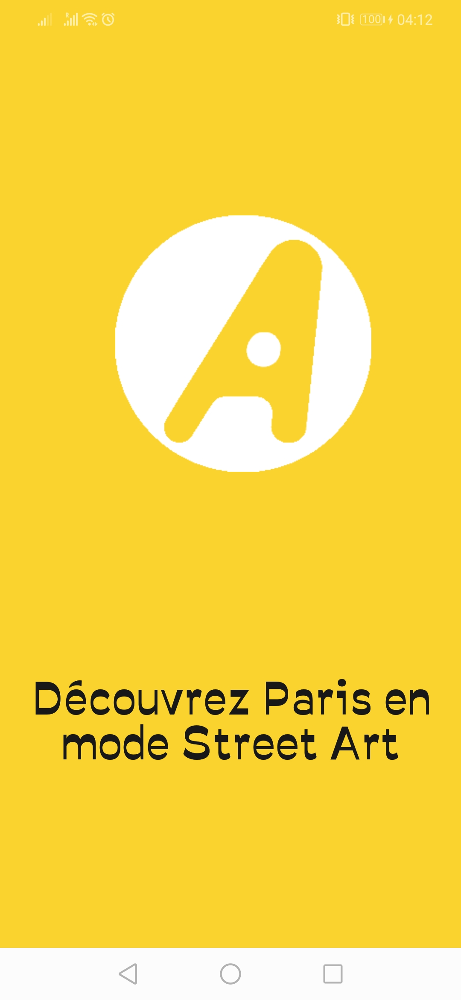
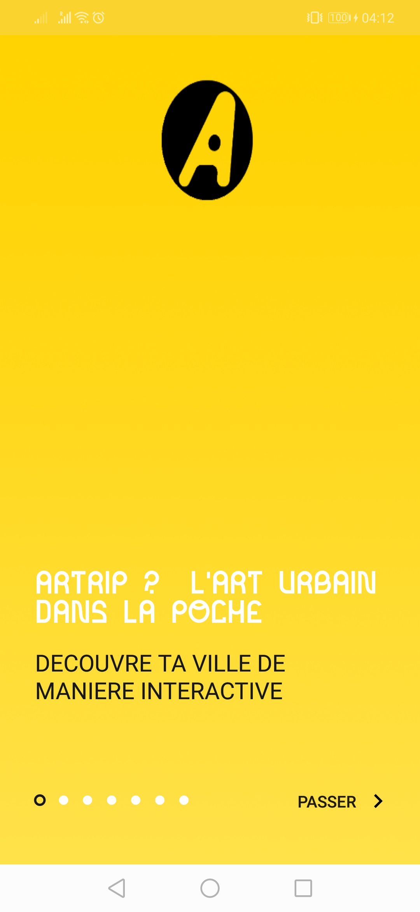
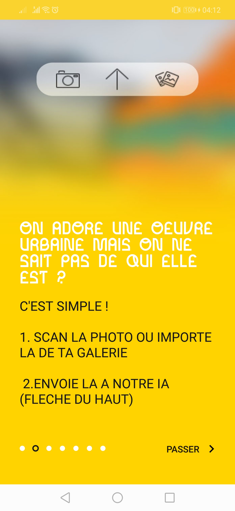
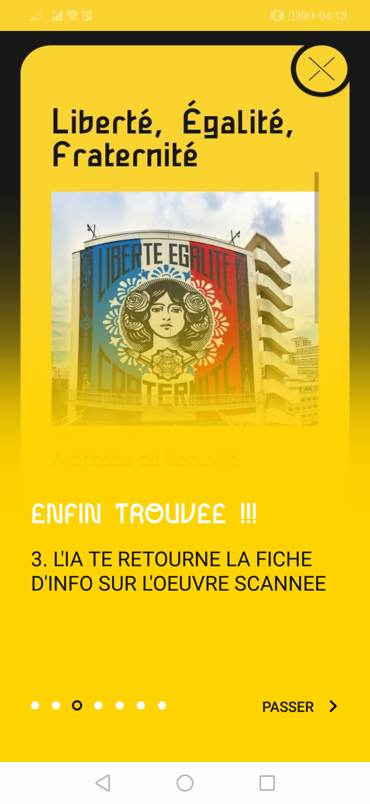
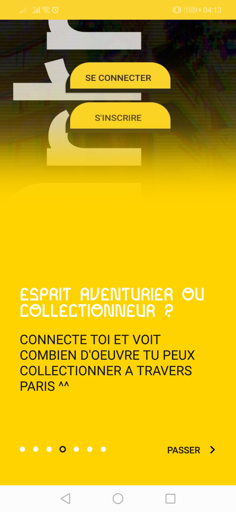
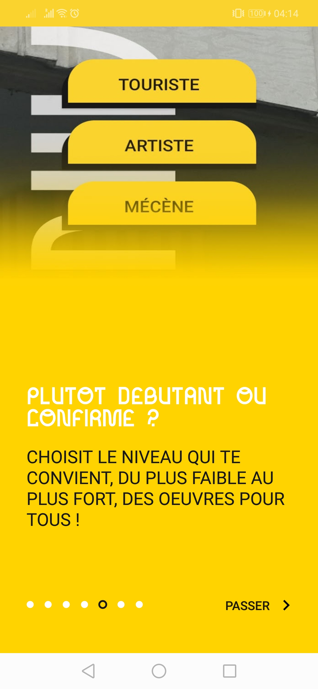
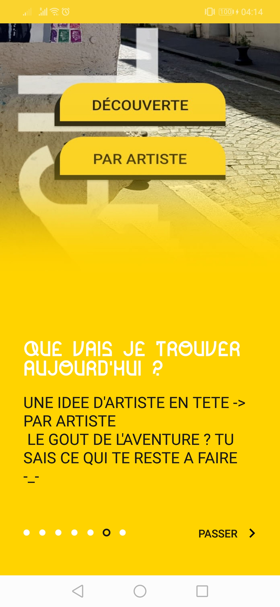
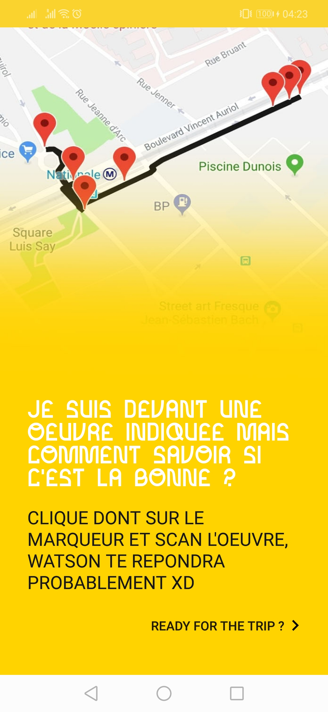

# Artrip for Android

**DEPRECATED : this project is no longer maintained (read-only). Please DO NOT fork/ re-use in any way, shape or form.**

Artrip (only available in French) is an app that offers to discover Paris thanks to city tours focused on street-art pieces. Artrip uses an IBM Watson AI trained on street-art from the 13th arrondissement of Paris.

It's simple to use: take a photo of a street-art piece and get an info card about it. You can also go on themed city tours to unlock art pieces and earn points.

## Concept

| | | | |
| -------- | ----------- | -------- | ----------- |
|  |  |  |  |
| Splash screen   | Urban art in your pocket: discover Paris interactively | Scan a street-art piece to learn about it | Get a info card after scanning |
|  |  |  |  |
| Create an account to collect art pieces | Go on a city tour with multiple tour options | Filter art pieces by artist   | Unlock art pieces during your city tour and earn points |

## Authors

Artrip is an academic project created in 2019 thanks to a joint effort by:
- BA Rokhaya Jennifer
- LERANDY Samuel
- MAATOUK Mary
- MASIONI Geneviève
- SOLEIMAN Agathe
- WEBER Romain

The project was supervised by Professor Camille KURTZ.
